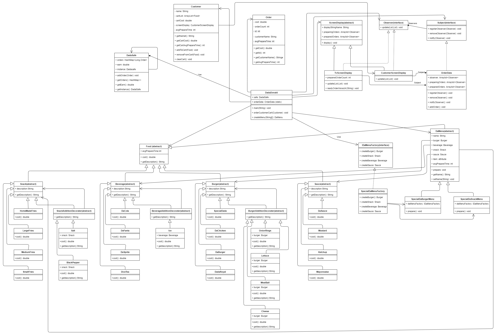

# Statement of Work

### The restaurant, whose name is DadaDonald, sells burgers, drinks, snacks and sauces. Customers approach the cashier and place their orders. Orders are made by choosing a menu or individual product. After the order is placed, the customer is given a screen that looks like a phone. The number of the orders that are prepared and preparing is displayed on this screen.

### When we set up this system, we face some problems. For example, we have a burger and we created a class for it. If the customer wants this burger with extra meatballs, then we need to create another class for it. If he also wants extra lettuce, another class for it… Our other problem is the information we give to the customer on the screen and on the television. In order to learn this information, he has to go and ask every time. If it has changed then it updates the information. It is a loss of performance for us to ask it every time. Another; We need to create menus. We create each menu by checking its name with if/else, which is undesirable for us.

### A Customer object is created when the customer is placing an order. Each customer object has a card list. The desired products are being added to this basket. When the customer orders the menu, the menu is created using the Factory pattern. If the customer orders a burger, extra cheese, lettuce meatballs and pickles can be added. He can order his drink with ice or as normal. Snacks can be selected with extra salt and pepper. After placing an order, the customer receives a phone-like screen. You can see the status of your order on this screen and on the wall TV in the restaurant.

# Explanation on Utilized Design Patterns

### Many design patterns are applied for solving existing problems in the project. I used 4 Design pattern for this project:

- Decorator Pattern
- Factory Pattern
- Observer Pattern
- Singleton Pattern

## Decorator Pattern:

### We have one Food asbtract class. Burgers, beverages, sauces and snacks extend this class. Our Beverage class has subclasses like DaCola, Dafanta … and we have another decorator subclass, its name is BeverageAdditionDecorater. Extra products extend this class. So, for example, if we are going to buy a drink, adding ice is an extra. So our Ice class extends this decorater class. Now if we buy a drink, we can easily add an extra. For example:

```
Beverage beverage=new DaCola();
beverage=new Ice(beverage);
```

### We have burger and snack classes like this one, and they also have a decorator subclass. Such usage saves us from creating too many unnecessary classes. This is the Decorator Pattern.

## Factory Pattern:

### There are 2 menus in the restaurant that the customer can take. We use the Factory Pattern structure to create these menus. We have 2 menus named SpecialDaBurgerMenu and SpecialDaSnackMenu that extend our abstract class named DaMenu. SpecialDadaMenuFactory, which implements the interface named IdaMenuFactory, creates these 2 menus. When the customer says the name of the menu, the method called createMenu() works. This method sends back what the customer wants by adding Factory to the menu. For example, the customer requested SpecialDaSnackMenu:

```
DaMenu daMenu= new SpecialDaBurgerMenu(new SpecialDaMenuFactory());
```

### Method gives us back the created daMenu. We then know how to ship it to order.

## Observer Pattern:

### As we know, the customer receives a screen after placing an order and there is order status information on this screen. The same information is shown on the TV on the wall. When the order status is updated, the information is also updated on the screens. To create this structure, we create the Observer Pattern. We have an Observer and Subject interfaces. Order information becomes Subject for us. Screens are Observer. When there is any change in the order information, new information is sent to the screens.

## Singleton Pattern:

### The restaurant has a safe. In DadaSafe, orders and times, earnings information are kept until now. This class requires a single instance and it is undesirable to create another instance. Therefore, Singleton Pattern structure is used.

## UML Diagram:


